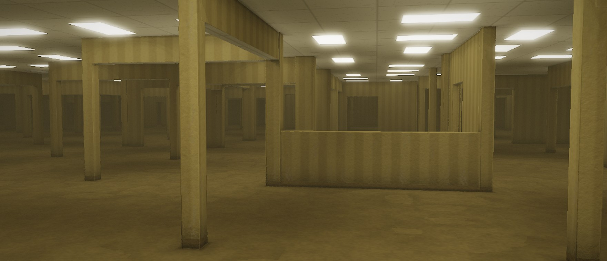
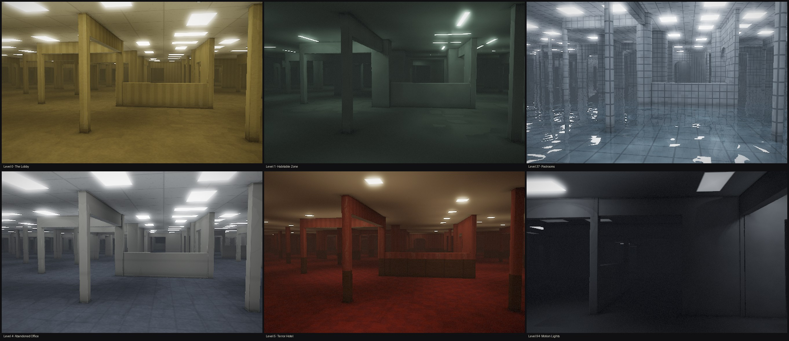
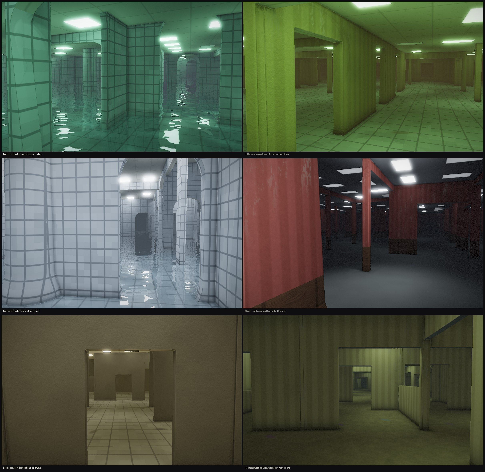
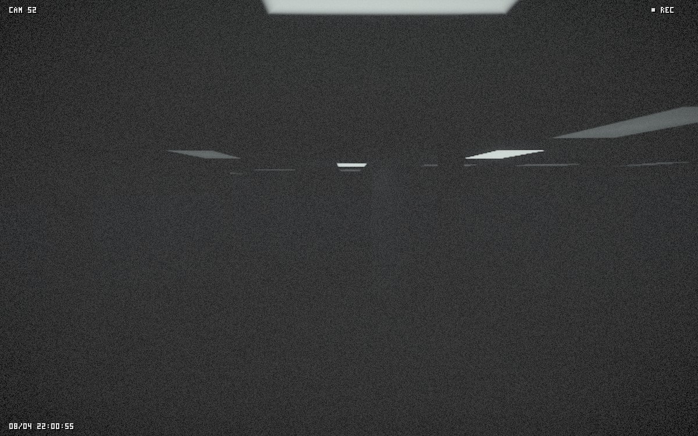
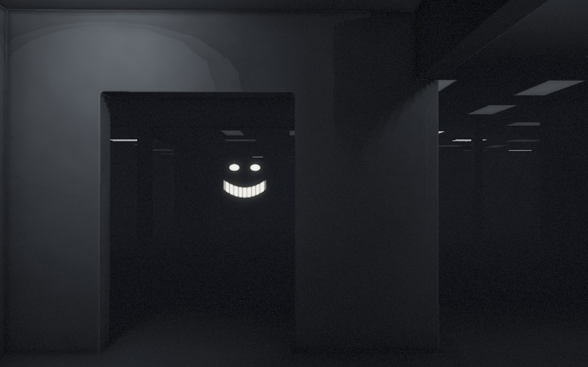

# Backrooms.saver

A generative liminal-space screen saver for macOS. An endless interior that
nobody built and nobody is in, toured by a camera that alternates between slow
cinematic drifts and locked-off CCTV angles.



Nothing here is modelled. One fragment shader raymarches an infinite grid of
rooms whose walls and doorways are decided by hashing the cell coordinates, so
the world is unbounded, deterministic and never stored — it is regenerated from
its coordinates every frame. Walk for an hour and you will not repeat a room.

Every archway, column and doorway is drawn from the same hashes: widths, crown
heights, how round or shallow an arch springs, whether it leans, whether a
column tapers or flares or has simply given up and tilted. The ceiling drifts
too, so rooms run from cramped to cathedral without a seam anywhere.

## Six levels

Every launch starts somewhere random, holds it a couple of minutes, then moves
on. These are all the **same floorplan and the same seed** — only the level
changes:



| Level | Motif |
| --- | --- |
| **0 · The Lobby** | Mono-yellow wallpaper, damp carpet, the buzz of too many fluorescents. |
| **1 · Habitable Zone** | Concrete pillar forests, sparse strip lights, thick fog. |
| **37 · Poolrooms** | White tile, arched openings, tall ceilings, and water on the floor with reflections and caustics. |
| **4 · Abandoned Office** | Beige drywall, grey-blue carpet tile, cubicle partitions, cold 4000 K light. |
| **5 · Terror Hotel** | Deep red wallpaper over dark wood wainscot, patterned carpet, low ceilings. |
| **94 · Motion Lights** | Near-dark concrete where the lights wake as you approach and die behind you. |

Getting between them depends on how far apart they are. Levels that share a
palette **melt** into each other over half a minute — that is how the poolroom
water rises out of the floor. Everything else **noclips**: the picture tears,
cuts to black, and you are somewhere else entirely.

## Fever levels

About a third of the time it does not go to a real level. It goes to a **fever**
level: a real one wearing other levels' surfaces, with the lighting gone wrong.



Floor, walls and ceiling each draw from *any* level independently, so the Lobby
can grow a poolroom tile floor or Motion Lights can be papered in Hotel crimson.
On top of that the light gets scaled and tinted, fog thickens or thins, the
ceiling rises or drops, and water can appear on any level rather than only in
the Poolrooms.

The best case is a fever of the level you are *already in*, because then it
melts rather than cuts — and the room you are standing in slowly goes wrong
around you, the lights sinking and the water coming up, without a single edit.

Every fever is reproducible: `--fever` is deterministic on the seed, and prints
what it made, so you can hunt for one and get back to it.

```bash
./build/backdev window --fever --seed 11   # the green one, second above
```

### Level 94 has a resident

Its lights track a walker rather than the camera. On a drift shot those are the
same thing. But the walk carries on during CCTV shots — so you sit on a fixed
camera and watch a pool of light move through rooms that you are not in.



### There is a horror dial

One line in [`Sources/Core/Director.swift`](Sources/Core/Director.swift):

```swift
public let kHorror: Float = 0.0
```

At `0.0`, the default, every horror term multiplies out and the piece stays
purely liminal — empty, calm, unsettling only through absence. Turn it up and it
scales continuously into entities, dead and buzzing tubes, deeper power sags,
building-wide blackouts, thicker fog, and glitches that fire mid-shot.

Dark levels get Smilers. Lit ones get something standing very still at the end
of a corridor. Both fade before you can reach them.



## Install

Requires macOS 13+ and the Xcode Command Line Tools. No Xcode project.

```bash
./build.sh install
```

Then pick **Backrooms** in System Settings → Screen Saver, under *Other*.
Deleting the bundle from `~/Library/Screen Savers` uninstalls it.

To watch one without installing:

```bash
./build/backdev window --seed 7
```

`backdev` also renders straight to PNG with no display attached, which is how
every image above was made. See [docs/internals.md](docs/internals.md) for its
flags and for how the thing actually works.

## Licence and credits

The code is [MIT](LICENSE).

Textures are from [ambientCG](https://ambientcg.com) (Wallpaper001A/001C and
Wood051), all **CC0 1.0** and bundled directly, so redistributing the built
saver is fine. Everything else (geometry, materials, lighting, grain) is
generated at runtime.
